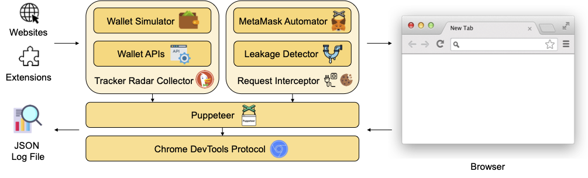

<div align="center">
  
</div>

<h1 align="center">Is Your Wallet Snitching On You?</h1>

A framework to quantify Web3 privacy violations such as Web3-based browser fingerprinting and wallet address leakage to third-parties by DApps and wallet extensions. Our paper can be found
[here](https://arxiv.org/pdf/2306.08170.pdf).

## Installation Instructions

We tested our framework on an Apple MacBook Pro 2021 with an Apple M1 Pro ARM chip running MacOS Monterey and on a Linux machine running Ubuntu Linux 22.04.02 LTS with a 12th Gen Intel(R) Core(TM) i9-12900K CPU. We used Python 3.9 on both machines to run our Python scripts.

### 1. Install MongoDB

##### MacOS

``` shell
brew tap mongodb/brew
brew update
brew install mongodb-community@6.0
```

##### Linux

``` shell
sudo apt-get install gnupg curl
curl -fsSL https://pgp.mongodb.com/server-6.0.asc | sudo gpg -o /usr/share/keyrings/mongodb-server-6.0.gpg --dearmor
echo "deb [ arch=amd64,arm64 signed-by=/usr/share/keyrings/mongodb-server-6.0.gpg ] https://repo.mongodb.org/apt/ubuntu jammy/mongodb-org/6.0 multiverse" | tee /etc/apt/sources.list.d/mongodb-org-6.0.list
sudo apt-get update
sudo apt-get install -y mongodb-org
```

For other operating systems follow the installation instructions on [mongodb.com](https://docs.mongodb.com/manual/installation/).

### 2. Install Python and its dependencies

##### MacOS

``` shell
python3 -m pip install -r requirements.txt
```

##### Linux

``` shell
sudo apt-get update -q
sudo apt-get install -y software-properties-common python3-distutils python3-pip python3-apt python3-dev
python3 -m pip install -r requirements.txt
```

### 3. Install Node.js and its dependencies

##### MacOS

``` shell
brew install node
cd framework/tracker-radar-collector
npm install
cd framework/request-interceptor
npm install
```

##### Linux

``` shell
curl -sL https://deb.nodesource.com/setup_18.x | bash -
apt-get update -q && apt-get install -y nodejs
cd framework/tracker-radar-collector
npm install
cd framework/request-interceptor
npm install
```

For other operating systems follow the installation instructions on [nodejs.org](https://nodejs.org/en/download/package-manager/).

## Download datasets and results

``` shell
wget https://zenodo.org/record/8071006/files/browser-fingerprinting-datasets.zip
unzip browser-fingerprinting-datasets.zip
mv datasets browser-fingerprinting/
rm browser-fingerprinting-datasets.zip
```

``` shell
wget https://zenodo.org/record/8071006/files/browser-fingerprinting-results.zip
unzip browser-fingerprinting-results.zip
mv results browser-fingerprinting/
rm browser-fingerprinting-results.zip
```

``` shell
wget https://zenodo.org/record/8071006/files/wallet-address-leakage-datasets.zip
unzip wallet-address-leakage-datasets.zip
mv datasets wallet-address-leakage/
rm wallet-address-leakage-datasets.zip
```

``` shell
wget https://zenodo.org/record/8071006/files/wallet-address-leakage-results.zip
unzip wallet-address-leakage-results.zip
mv results wallet-address-leakage/
rm wallet-address-leakage-results.zip
```

## Running Instructions

### Detect Web3-based browser fingerprinting

To detect for example if ```nytimes.com``` tries to access wallet information such as ```window.ethereum```, run the following commands:

``` shell
cd framework/tracker-radar-collector
npm run crawl -- -u "https://www.nytimes.com" -o ./data/ -f -v -d "requests,targets,apis,screenshots"
cat data/www.nytimes.com_89db.json | grep ethereum -C 10
```

The terminal should display ```window.ethereum``` along with other JavaScript properties.

### Analyze Web3-based browser fingerprinting

To analyze Web3-based browser fingerprinting and reproduce the results in our paper, run the following commands:

``` shell
cd browser-fingerprinting/results
mkdir db
mongod --dbpath db
mongoimport --uri="mongodb://localhost:27017/web3_privacy" --collection fingerprinting_results --type json --file fingerprinting_results.json
```

``` shell
cd browser-fingerprinting/analysis
python3 analyze_detected_fingerprinting.py
```

### Detect wallet address leakage

To detect for example if ```notional.finance``` is leaking your wallet address to a third-party, run the following commands:

``` shell
cd framework/request-interceptor
node run --interactive -u https://notional.finance/portfolio --debug verbose -w metamask-chrome-10.22.2 -t 30
cat notional.finance.json | grep 7e4abd63a7c8314cc28d388303472353d884f292
```

The terminal should display several entries which highlight that the wallet address is being leaked by the DApp to third-parties.

### Analyze wallet address leakage

To analyze wallet address leakage and reproduce the results in our paper, run the following commands:

``` shell
cd wallet-address-leakage/analysis
python3 find-leaks-and-scripts-winter-et-al.py ../results/whats_in_your_wallet/crawl ../datasets/whats_in_your_wallet
python3 find-leaks-and-scripts-dapps.py
python3 find-leaks-and-scripts-wallet-extensions.py
```

## Artifact Evaluation Experiments

### E1

This experiment takes around 5 human-minutes + 5 compute-minutes. The goal is to analyse the data that was gathered during our crawl on the top 100K websites in November 2022 and parsed via our browser fingerprinting detection script. Performing the entire crawl from scratch on the top 100K websites would take very long and result in different results as the web keeps on changing. Therefore, we provide a dump of our MongoDB collection which already contains the data processed by our fingerprint detection script. The dump can be imported to analyze our findings. However, for reproducibility purposes we also provide a raw snapshot of all the requests and JavaScript calls that were collected via our crawl in November 2022.
        

Download the browser fingerprinting datasets using:

```
wget https://zenodo.org/record/8071006/files/browser-fingerprinting-datasets.zip 
unzip browser-fingerprinting-datasets.zip
mv datasets browser-fingerprinting/
rm browser-fingerprinting-datasets.zip
```

Download the browser fingerprinting results using:

```
wget https://zenodo.org/record/8071006/files/browser-fingerprinting-results.zip
unzip browser-fingerprinting-results.zip
mv results browser-fingerprinting/
rm browser-fingerprinting-results.zip
```

Change the working directory using:

```
cd browser-fingerprinting/results
```

Import the MongoDB dump by first creating a temporary directory using:

```
mkdir db
```

Afterwards, run MongoDB locally using the temporary directory: 

```
mongod --dbpath db
```

Import the collection using:

```
mongoimport --uri="mongodb://localhost:27017/web3_privacy" --collection fingerprinting_results --type json --file fingerprinting_results.json
```

After having imported the MongoDB dump and making sure that MongoDB is running, we can run the analysis script by first chaining our working directory using:

```
cd browser-fingerprinting/analysis
```

and running the analysis script using:

```
python3 analyze_detected_fingerprinting.py
```

The terminal will display Tables 3, 4, 5, and 6, which should be equivalent to the tables included in the paper. Moreover, the script will also output in the same directory as the analysis script a PDF file named ```blocklists.pdf``` which should be equivalent to Figure 5 in the paper.

### E2

This experiment takes 5 human-minutes + 5 compute-minutes. The goal is to analyze the requests collected via our interceptor on the 66 DApps by Winter et al. and compare them to the results of Winter et al. Performing the entire crawl from scratch on 66 websites would take very long and result in different results as the web keeps on changing. Therefore, we provide a snapshot of all the requests that we intercepted during our crawl.

Download the wallet address leakage datasets using:

```
wget https://zenodo.org/record/8071006/files/wallet-address-leakage-datasets.zip 
unzip wallet-address-leakage-datasets.zip
mv datasets wallet-address-leakage/
rm wallet-address-leakage-datasets.zip
```

Download the wallet address leakage results using:

```
wget https://zenodo.org/record/8071006/files/wallet-address-leakage-results.zip
unzip wallet-address-leakage-results.zip
mv results wallet-address-leakage/
rm wallet-address-leakage-results.zip
```

Change the working directory using:

```
cd wallet-address-leakage/analysis
```

Run the comparison script using:

```
python3 find-leaks-and-scripts-winter-et-al.py ../results/whats_in_your_wallet/crawl ../datasets/whats_in_your_wallet
```

The terminal will display at the end Table 7, which should be equivalent to Table 7 included in the paper.

### E3

This experiment takes 5 human-minutes + 60 compute-minutes. The goal is to analyze the requests collected via our interceptor on the DAppRadar.com dataset. Performing the entire crawl from scratch on DAppRadar.com dataset would take very long and result in different results as the web keeps on changing. Therefore, we provide a snapshot of all the requests that we intercepted during our crawl.

Change the working directory using:

```
cd wallet-address-leakage/analysis
```

Run the analysis script using: 

```
python3 find-leaks-and-scripts-dapps.py
```

The terminal will display at the end Tables 8 and 9, which should be equivalent to Tables 8 and 9 included in the paper.
